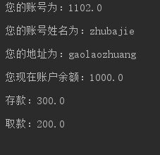

# 类的说明

## bank 类
* 定义账号 `double account`;
* 定义账号使用者  `String accountName`;
* 定义使用者的地址    `String accountAdress`;

## user类
* 定义存款 `double deposit`;//存款
* 定义支出   ` double out`;
* 定义存入    `double in`;

# 结果截图 
